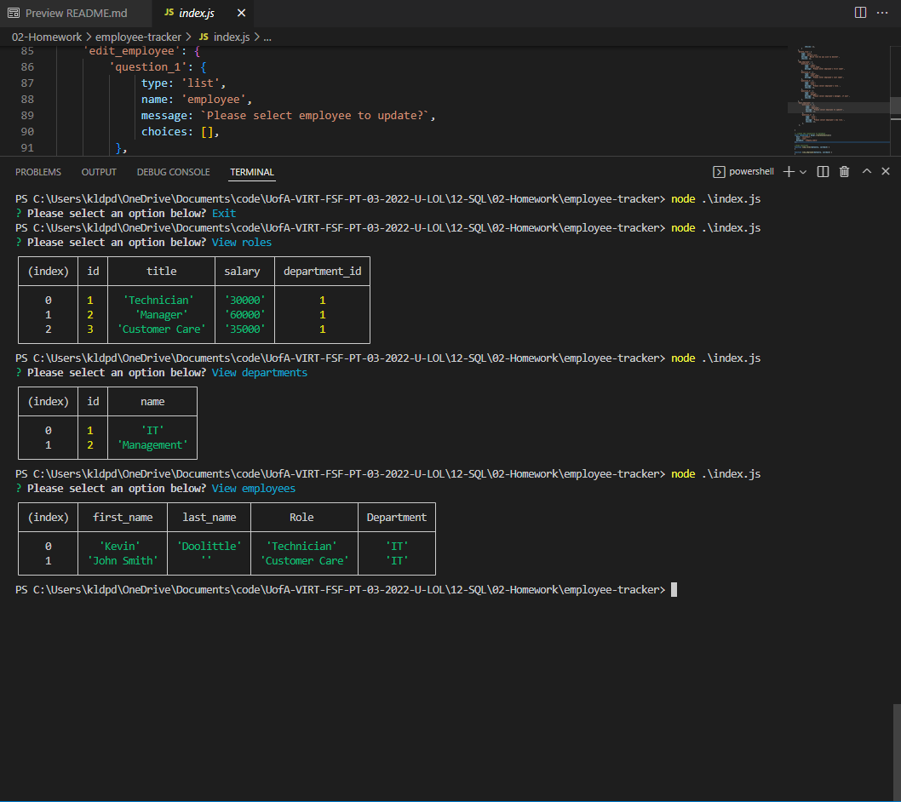

# Employee Tracker  

## User Story  

-AS A business owner  
-I WANT to be able to view and manage the departments, roles, and employees in my company  
-SO THAT I can organize and plan my business  

## Description  

-Node.js program using mysql to create a database of employees as well as their roles and departments  

## Built With 

-Javascript  
-Node.js  
-mySQL  
 
## Installation  

`npm init`
  
`npm install`

## Usage  

-Run the following command at the root of your project and answer the prompted questions:  
  
`node index.js`

## Video Link

-https://www.youtube.com/watch?v=ke0H3XDDkoc  

## Screenshot  

